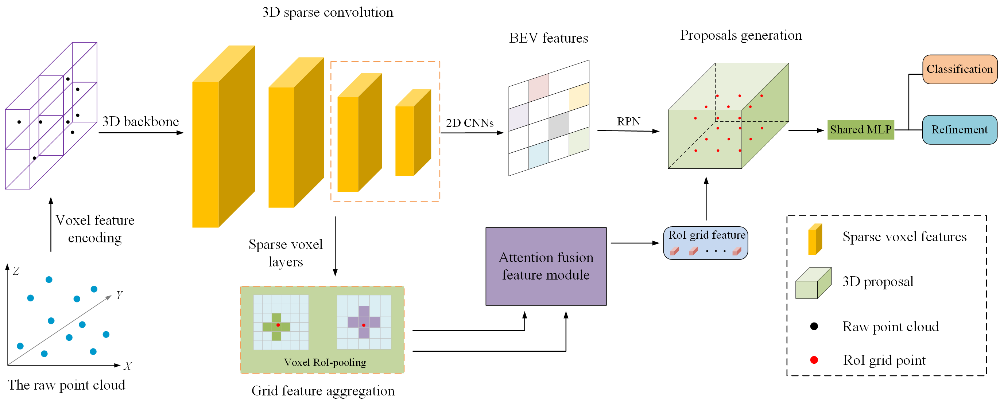

# GAF-RCNN

 
This is the official implementation of [**GAF-RCNN: Grid attention fusion 3D object detection from point cloud**](https://arxiv.org/abs/2111.14382), built on [`OpenPCDet`](https://github.com/open-mmlab/OpenPCDet).


## Environment:

    Linux (tested on Ubuntu 18.04 )
    Python 3.8
    PyTorch 1.10.1
    CUDA 10.2

## Results on KITTI test set

[Submission link](http://www.cvlibs.net/datasets/kitti/user_submit_check.php?benchmark=object&result=a7e3573aa49898404df4951ef95dd325b3ba435f)

## Results on KITTI val set
```
Car AP@0.70, 0.70, 0.70:
bbox AP:96.9434, 89.7388, 89.3707
bev  AP:90.4554, 88.3258, 87.8466
3d   AP:89.7247, 84.6176, 78.8791
aos  AP:96.92, 89.67, 89.25
Car AP_R40@0.70, 0.70, 0.70:
bbox AP:98.3736, 95.0387, 94.6924
bev  AP:93.5902, 91.3477, 89.1091
3d   AP:92.6164, 85.1212, 82.8227
aos  AP:98.36, 94.94, 94.51
Car AP@0.70, 0.50, 0.50:
bbox AP:96.9434, 89.7388, 89.3707
bev  AP:97.0291, 95.5101, 89.3869
3d   AP:96.9853, 89.6750, 89.3683
aos  AP:96.92, 89.67, 89.25
Car AP_R40@0.70, 0.50, 0.50:
bbox AP:98.3736, 95.0387, 94.6924
bev  AP:98.4325, 96.7931, 94.8477
3d   AP:98.4149, 94.9881, 94.7893
aos  AP:98.36, 94.94, 94.51
 
```

# Acknowledgement
Our code is based on [OpenPCDet](https://github.com/open-mmlab/OpenPCDet). Thanks OpenMMLab Development Team for their awesome codebases.
